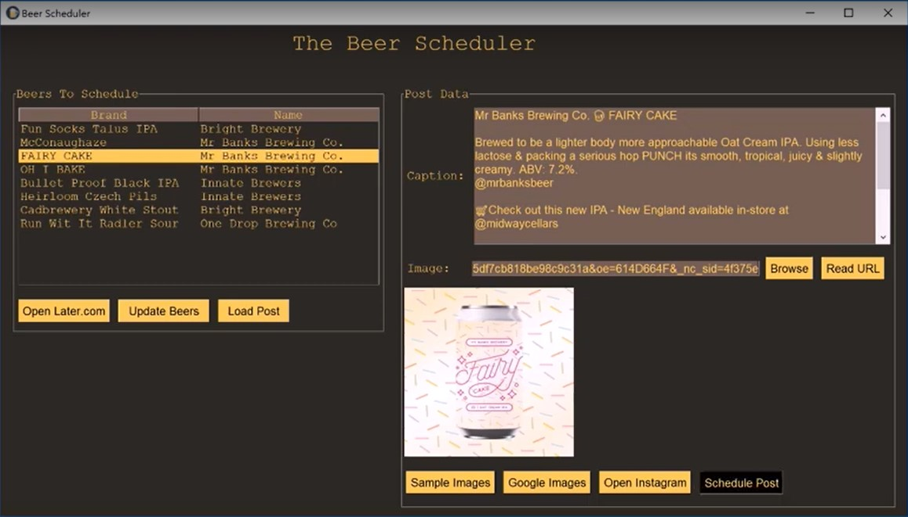

# The Instagram Scheduler 

This repository serves to automate many of the processes associated with creating and posting [Instagram](https://www.instagram.com/) posts. 

This project was focused upon creating Instagram content for **Bottleshops/Liquorshops** to increase online engagement for these companies whilst reducing the amount of time that is needed to maintain these online accounts. The scope of this repository includes functions such as:
* Allowing users to schedule Instagram posts into the future
* Autonomously generate content, descriptions and hashtags for a particular post. 
* Locate images that would be suitable to be used for a particular post
* Automatically follow Instagram users are that deemed to be part of the desired audience demographic

  
 
This repository is divided up into 5 main module which are:
1. **Later.com**  
    * Interacts with [Later.com](https://later.com/) APIs to schedule Instagram posts. [Later.com](https://later.com/) was used to schedule Instagram posts because convention methods such as browser automation and HTTP requests have a high chance of being detected by Instagram which could likely lead to your account being [shadowbanned](https://later.com/blog/instagram-shadowban) 
2. **Untapped.com**
    * Retrieves and generates liquor from the [Untapped.com](https://untappd.com/) website related Instagram content
3. **ImageSearch**
    * Finds a selection of images that are suitable to be used for a particular Instagram post
4. **Instagram Bot**
    * Automates Instagram actions such as following users and liking posts
5. **Google Cloud API**
    * Updates a Google Calendar to inform the user on when the next Instagram post is scheduled
 
  
 
### A video of the implementation of this project can be seen in the following image link.

  
 
# Later.com Module

This module deals with retrieving and passing information to the Later.com API. Later.com is a social media management tool that allows you to schedule posts across platforms such as Instagram and Facebook. 

Interactions with the [Later.com](https://later.com/) API are performed using HTTP requests and Browser Automation through the use of the python module Selenium. [Later.com](https://later.com/) was used to schedule Instagram posts because convention methods such as browser automation and HTTP requests have a high chance of being detected by Instagram which could likely lead to your account being [shadowbanned](https://later.com/blog/instagram-shadowban) 

### File Structure

This module is separated into three files:

1. **Later.py**
    * Handles all HTTP requests with the Later.com API
2. **LaterHelper.py**
    * Contains helper functions for *Later.py* such as saving and loading cookies
3. **LaterChromedriver.py**
    * Handles the browser automation that interacts with the Later.com API such as uploading images.

### API Interactions

The [mitmproxy](https://github.com/mitmproxy/mitmproxy) repository was used to perform a [Man in the Middle Attack](https://en.wikipedia.org/wiki/Man-in-the-middle_attack) on an android device that interacted with the Later.com website. By reading the requests sent and received from the API, the appropriate requests were able to be found to perform functions such as: 
+ Logging In
+ Scheduling an Instagram Post
+ Retrieving Data on Uploaded Images

### Browser Automation

There was one function that was unable to be implemented by using HTTP requests and that was the uploading of an image to the Later.com servers. Later.com utilised *AWS (Amazon Web Services)* and therefore an encryption was required to be able to upload files such as images to their servers. Therefore the only way to autonomously upload images to the Later.com servers was to use *Browser Automation* to upload the image through Later.com website.

The [selenium](https://selenium-python.readthedocs.io/) library and [chromedriver](https://chromedriver.chromium.org/downloads) were used to perform this browser automation to upload images to the servers.

  
 
# Untapped.com Module

This module deals with retrieving information from the [Untapped.com](https://untappd.com/) website using HTTP requests. Untapped.com is a networking service website that allows:
* *bottleshops* to upload their recent beer stock 
* *users* to discuss beers they have recently drunk

This module was used to retrieve information and create beer descriptions on the latest beers that have been uploaded by a specific bottleshop.

### File Structure

This module is separated into three files:

1. **Untapped.py**
    * This file saves and retrieves the information extracted from the requestsUntapped.py module into CSV files.
2. **requestsUntapped.py**
    * This file handles all interactions with the Untapped.com website as well as the formation of beer descriptions.
3. **configuration.py**
    * This file contains the HTTP header information that were passed with each HTTP request.  
  
# ImageSearch Module

This module deals with the retrieval and downloading of beer related images. Given the name of a particular beer and the brewer this module uses *Google-Images* to locate images of that beer. 

This module also performs *Google-Reverse-Image-Search* to find the original source of an image so that the original creator of that image can be properly credited in an Instagram post description if that image was to be used. 

  
 
# Instagram Bot Module

This module uses an unoffical [Instagram API library](https://github.com/Julian-O/Instagram-API-python) to automate common Instagram actions. 

This [Instagram API library](https://github.com/Julian-O/Instagram-API-python) repository is build off the [Instagram Legacy API](https://www.instagram.com/developer/) which was depreciated by Facebook as of June 29, 2020. Therefore this whole module also became depricated at this time.

### Features

* This module was able to automate actions such as:
    * Get list of people that *Liked* a particular Instagram post
    * Get basic profile information about a particular user such as their username, full-name and number of followers
    * Get the latest posts in the logged in users *Instagram Feed*
    
    * Given a list, follows or unfollows all the users in that list
    * Unfollows all the users that are not current following the logged in user
    * *Like* the last 3 posts from a particular user
    * *Comment* on the last post of a particular user
    * Determine the most popular hashags related to a particular keyword
    * Returns the a list of the most liked users that relate to a particular hashtag
    * Determine the location of a list of users by using the GeoTags in their posts
    * Return the users that follow a particular user
    * Returns the latest Instagram notifications for the logged in user

### File Structure

This module is separated into three files:

1. **InstaBot.py**
    * This file utilises the [Instagram API library](https://github.com/Julian-O/Instagram-API-python) to interact with the [Instagram Legacy API](https://www.instagram.com/developer/) 
2. **post_images.py**
    
    * This uses browser automation using [selenium](https://selenium-python.readthedocs.io/) to post an image onto Instagram 
3. **post_hashtags.py**
    * This uses browser automation using [selenium](https://selenium-python.readthedocs.io/) to comment on a particular Instagram post. 

  
 
# Google Cloud API Module

This module utilises the Google Cloud Platform, in particular the [Google Drive API](https://developers.google.com/drive/api/v3/about-sdk) and the [Google Calendar API](https://developers.google.com/calendar).

This module was used to create a Google Calendar and create events to inform users when the upcoming scheduled Instagram posts would be posted to Instagram. Functions relating to the uploading and downloading of files into one's Google Drive were also included.

### File Structure

This module is separated into three files:

1. **login.py**
    * Passes the appropriate login credentials into the Google APIs.
2. **add_calendar.py**
    
    * Schedules calendar events in a Google Calendar
3. **get_file.py**
    * Downloads particular files from one's Google Drive

    

